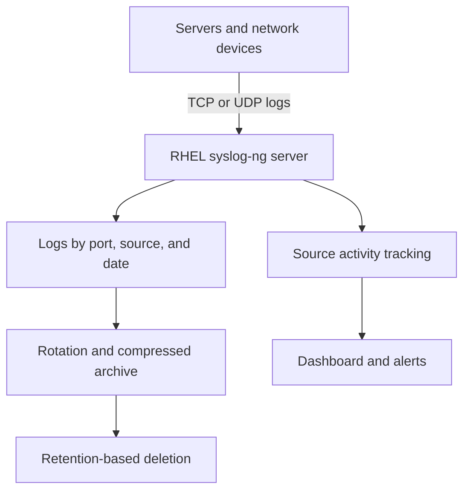

# Syslog-ng Centralized Logging on RHEL

This project contains the planning, estimation, technical study notes, implementation workflow, operations documentation, testing criteria, and handover resources for a centralized syslog-ng solution on Red Hat Enterprise Linux.

## Project Objectives

- Install and configure syslog-ng on RHEL.
- Receive logs on approved TCP and UDP ports.
- Store logs by listener port, source IP, and date.
- Rotate, compress, archive, and delete logs according to policy.
- Track the last time data was received from each source and port.
- Display log-flow activity through dashboards and alerts.
- Provide testing evidence, a runbook, and a client handover package.

## Architecture



## Project Structure

```text
syslog-ng-centralized-logging/
├── README.md
├── study-notes/
│   └── SyslogNG-Centralized-Logging-Study-Notes.md
├── bid-estimate/
│   ├── SyslogNG-Bid-Estimate.md
│   └── SyslogNG-Upwork-Bid-Feasibility-and-Cost-Estimate.xlsx
├── implementation-plan/
│   └── SyslogNG-Implementation-Plan.md
└── documentation/
    ├── Architecture-and-Design.md
    ├── Operations-Runbook.md
    ├── Troubleshooting-Guide.md
    ├── Testing-and-Acceptance.md
    └── Handover-Checklist.md
```

## Delivery Phases

| Phase | Deliverable |
|---|---|
| 1 | Discovery, requirements, assumptions, and design |
| 2 | RHEL preparation and syslog-ng installation |
| 3 | TCP/UDP listeners, routing, and source-based storage |
| 4 | Rotation, compression, archive, and retention |
| 5 | Last-received activity tracking |
| 6 | Dashboard, source status, and alerts |
| 7 | Testing, documentation, and handover |

## Important Safety Rules

- Test configurations before restarting the production service.
- Back up existing configuration before making changes.
- Never disable SELinux or the firewall as a permanent shortcut.
- Never test deletion on valuable production logs.
- Obtain written approval for retention and deletion policies.
- Do not commit client credentials, private configurations, sensitive logs, or identifiable screenshots.

## Status

This repository is a reusable project-delivery template. Final commands, ports, paths, retention rules, and monitoring integrations must be adapted to the client’s approved environment.

## Author

**Muhammad Khalid Khan**  
GitHub: [krmaryum](https://github.com/krmaryum)

