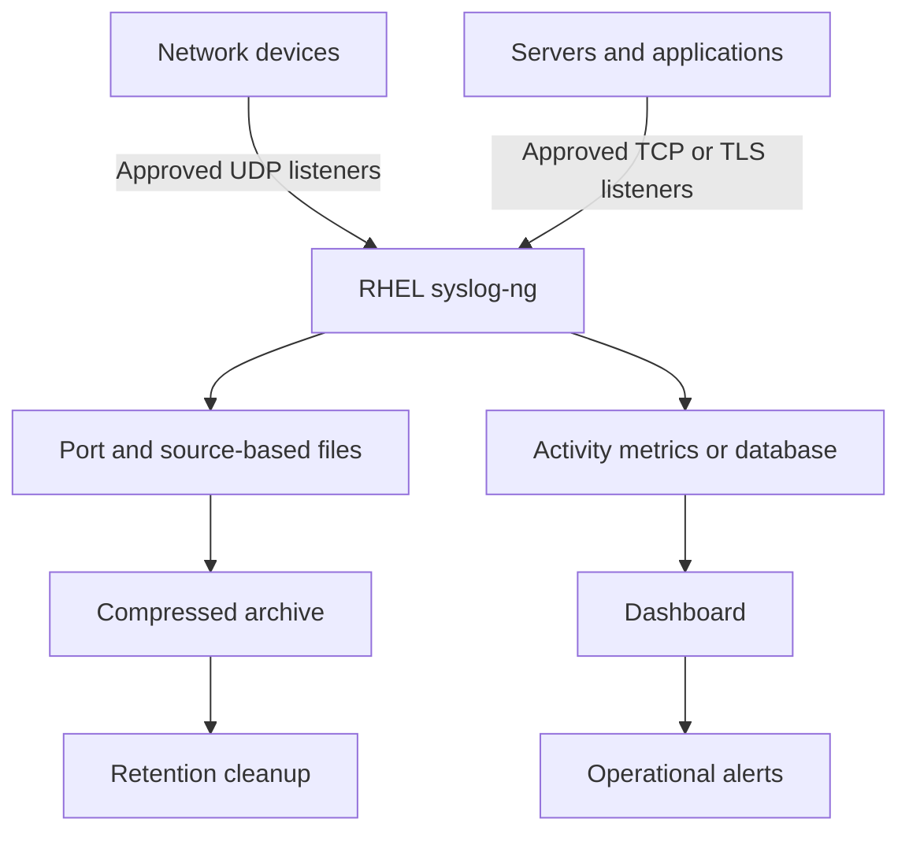

# Architecture and Design

## 1. Logical Architecture



## 2. Components

| Component | Responsibility |
|---|---|
| Source systems | Generate and transmit logs |
| Network/firewall | Permit only approved traffic |
| syslog-ng | Receive, filter, route, and write messages |
| Log filesystem | Store active and archived logs |
| Lifecycle process | Rotate, compress, archive, and delete |
| Activity store | Maintain source, port, count, and timestamps |
| Dashboard | Display flow, status, and capacity |
| Alerting | Notify operators of service, source, or disk problems |

## 3. Data Flow

1. A source sends a syslog message.
2. The RHEL firewall permits the approved source and listener.
3. Syslog-ng receives the message.
4. The configured log path identifies its destination.
5. The message is written under the approved source/port path.
6. Activity tracking updates the source’s last-received state.
7. Monitoring displays current and historical flow.
8. Lifecycle automation rotates and compresses older files.
9. Approved expired archives are deleted.

## 4. Proposed Directory Layout

```text
/var/log/remote/
├── active/
│   ├── port-514/
│   │   └── SOURCE_IP/
│   └── port-1514/
│       └── SOURCE_IP/
└── archive/
    ├── port-514/
    └── port-1514/
```

This path is an example. The final design must follow the client’s filesystem, backup, security, and naming standards.

## 5. Capacity Design

Required inputs:

- Average daily log volume
- Peak events per second
- Retention days
- Compression ratio
- Growth factor
- Safety margin
- Database and monitoring overhead

## 6. Security Design

- Restrict firewall access by source and port.
- Prefer TCP/TLS for important or sensitive logs.
- Apply least-privilege file ownership and permissions.
- Keep SELinux enforcing and use appropriate contexts/policies.
- Separate operator, database, and dashboard credentials.
- Audit configuration changes.
- Protect archives according to their data classification.

## 7. Availability

The baseline design uses one server and therefore has a single point of failure. If continuous collection is required, the client must approve a separate high-availability design covering redundant receivers, load distribution, replicated storage, database availability, and recovery testing.

## 8. Final Design Inputs

| Input | Client-approved value |
|---|---|
| RHEL version | To be confirmed |
| syslog-ng version | To be confirmed |
| Source count | To be confirmed |
| Listener ports | To be confirmed |
| Protocols | To be confirmed |
| Daily volume | To be confirmed |
| Retention | To be confirmed |
| Dashboard platform | To be confirmed |
| Database platform | To be confirmed |
| Alert destinations | To be confirmed |

