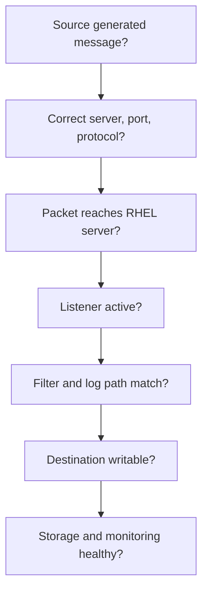

# Syslog-ng Troubleshooting Guide

## Isolation Method

Troubleshoot in this order:



## Problem 1 — syslog-ng Does Not Start

### Checks

```bash
sudo syslog-ng --syntax-only
sudo systemctl status syslog-ng
sudo journalctl -u syslog-ng --no-pager -n 100
```

### Likely causes

- Syntax error
- Duplicate port binding
- Missing included file
- Invalid destination path
- Permission problem
- SELinux denial
- Unsupported configuration option

### Response

Correct the specific error or restore the last validated configuration. Do not repeatedly restart without reading the error.

## Problem 2 — Port Is Not Listening

```bash
sudo ss -lntup
sudo syslog-ng --syntax-only
```

Check:

- Correct TCP/UDP transport
- Correct interface and port
- Another process already owns the port
- Service loaded the expected configuration
- SELinux permits the bind

## Problem 3 — Client Cannot Reach the Listener

Check:

- Correct destination IP
- Correct port and protocol
- Client routing
- Network ACLs and firewalls
- RHEL firewall
- Packet arrival using an approved packet-capture method

If no packet reaches the RHEL server, the problem is before syslog-ng.

## Problem 4 — Packet Arrives but No File Is Written

Check:

- Source is connected to the correct log path.
- Filters do not exclude the message.
- Dynamic directory values are valid.
- Destination directory exists or can be created.
- syslog-ng has write permission.
- SELinux context permits writing.
- Filesystem is mounted and has free space.

## Problem 5 — Wrong Source or Port Folder

Check:

- The listener-specific destination mapping.
- Source-IP macro/value behavior.
- NAT or load balancer effects.
- Hostname resolution behavior.
- Template syntax.
- Whether messages are entering through a different listener.

## Problem 6 — Rotation Stops Logging

Check:

- Whether syslog-ng still writes to the renamed file.
- Whether a reload/reopen signal is required by the approved design.
- File ownership after rotation.
- Directory permissions.
- Rotation configuration errors.

Always force rotation first in a controlled test environment.

## Problem 7 — Archive Is Not Compressed

Check:

- Compression option enabled
- Compression utility available
- Rotation completed successfully
- Permissions on archive directory
- Sufficient temporary disk space
- Lifecycle job logs

## Problem 8 — Old Archives Are Not Deleted

Check:

- Correct retention value
- Correct file age semantics
- Correct starting path
- Correct filename pattern
- Scheduler or timer status
- Permission to remove files

Do not broaden the deletion match until test output proves exactly which files will be removed.

## Problem 9 — Last-Received Time Is Not Updating

Check:

- Messages are actually arriving.
- Activity integration receives the correct fields.
- Database connection and authentication work.
- Upsert/update logic matches source, port, and protocol.
- Timezone handling is consistent.
- Activity failures are not blocking log storage.

## Problem 10 — Dashboard Shows No Data

Check:

- Data source connectivity
- Query time range
- Source/port filters
- Dashboard variable values
- Database or metrics permissions
- Timezone mismatch
- Metric update schedule

## Problem 11 — Disk Is Filling Quickly

```bash
df -h
sudo du -xhd1 /var/log/remote 2>/dev/null
```

Check:

- New or noisy sources
- Rotation failure
- Compression failure
- Retention failure
- Duplicate routing
- Unexpected debug logging
- Database growth

Do not solve capacity incidents by deleting unknown data. Follow the approved emergency process.

## Incident Evidence Checklist

- [ ] Date and timezone
- [ ] Affected source, port, and protocol
- [ ] Service status
- [ ] Listener status
- [ ] Relevant sanitized error messages
- [ ] Disk usage
- [ ] Recent changes
- [ ] Actions attempted
- [ ] Result and rollback status

