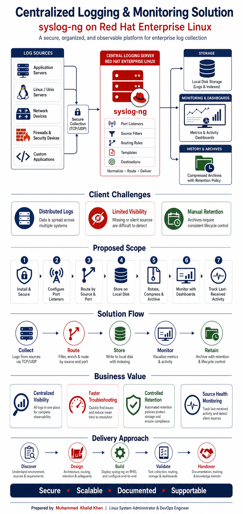
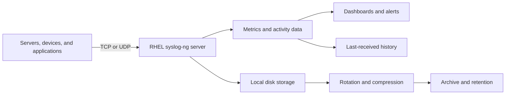

# Centralized Logging and Monitoring Solution

## syslog-ng on Red Hat Enterprise Linux

This client-facing poster presents a proposed centralized logging and monitoring solution using **syslog-ng on Red Hat Enterprise Linux**.

The solution is designed to collect logs from multiple infrastructure and application sources, organize them according to source and port, manage their lifecycle, monitor log activity, and identify systems that have stopped sending data.

---

## Project Poster



> Store this README in the same parent folder as the `images` directory so the relative image link renders correctly on GitHub.

---

## Client Challenges

### Distributed Logs

Log data may be spread across many servers, network devices, firewalls, and applications. This makes centralized analysis and troubleshooting difficult.

### Limited Visibility

When a source stops forwarding logs, administrators may not notice the issue immediately. Missing log data can create monitoring and audit gaps.

### Manual Retention

Without a consistent lifecycle policy, old logs can consume storage or be deleted incorrectly. Rotation, compression, archiving, and deletion must be controlled.

---

## Proposed Solution

The proposed platform uses a central RHEL server running syslog-ng.



The central server receives messages from approved sources, processes them through filters and routing rules, and writes them to controlled destinations.

---

## Proposed Scope

### 1. Install and Secure

- Install syslog-ng on the approved RHEL server.
- Validate the service configuration.
- Configure service startup.
- Apply firewall, SELinux, ownership, and permission requirements.

### 2. Configure Port Listeners

- Configure approved TCP and UDP listeners.
- Use TLS where secure transport is required.
- Bind only to approved interfaces.
- Restrict access to authorized sources.

### 3. Route by Source and Port

- Identify the receiving listener.
- Filter messages according to source or use case.
- Route messages to the correct destination.
- Apply consistent output templates.

### 4. Store on Local Disk

- Create organized directory structures.
- Separate logs by listening port and source.
- Use date-based filenames where required.
- Apply controlled permissions and disk monitoring.

### 5. Rotate, Compress, and Archive

- Rotate active logs according to schedule or size.
- Compress older files.
- Move logs into approved archive storage.
- Delete only expired archives according to the approved retention policy.

### 6. Monitor with Dashboards

- Display log volume over time.
- Show traffic by source and port.
- Monitor healthy, warning, and inactive sources.
- Display disk and service status.
- Configure source-inactivity alerts.

### 7. Track Last-Received Activity

- Record source IP.
- Record listener port and protocol.
- Record the latest received timestamp.
- Maintain message activity counters where required.
- Identify sources that stop forwarding logs.

---

## Solution Flow

| Stage | Purpose |
|---|---|
| Collect | Receive logs from approved sources over TCP or UDP |
| Route | Filter and direct messages by source, port, or use case |
| Store | Write logs to organized local-disk destinations |
| Monitor | Display metrics, activity, source status, and alerts |
| Retain | Rotate, compress, archive, and delete according to policy |

---

## Business Value

### Centralized Visibility

Administrators can review log activity from multiple systems through one controlled platform.

### Faster Troubleshooting

Source-based organization and graphical monitoring make it easier to locate relevant data and identify failures.

### Controlled Retention

Automated lifecycle policies help control storage use while protecting required log data.

### Source Health Monitoring

Last-received tracking helps identify servers, devices, and applications that have stopped forwarding logs.

---

## Delivery Approach

### Discover

Confirm the environment, source inventory, ports, protocols, expected volume, retention, security, and monitoring requirements.

### Design

Create the final architecture, routing rules, directory structure, storage estimate, lifecycle policy, and acceptance criteria.

### Build

Install and configure syslog-ng, local storage, activity tracking, dashboards, and alert rules.

### Validate

Test every approved source and listener, rotation and retention, dashboard visibility, last-received tracking, and source-inactivity alerts.

### Handover

Deliver the final configuration, architecture, test evidence, operations runbook, troubleshooting guide, and knowledge-transfer session.

---

## Expected Deliverables

- Validated syslog-ng installation on RHEL
- Approved TCP/UDP/TLS listener configuration
- Source- and port-based log storage
- Automated rotation and compression
- Controlled archive retention and deletion
- Graphical monitoring dashboard
- Source-inactivity alerts
- Last-received activity report
- Testing and acceptance evidence
- Operations and troubleshooting documentation
- Final knowledge transfer

---

## Important Client Inputs

The final design and estimate depend on the following information:

- RHEL version and server specifications
- Number of log sources
- Source IP addresses and technical owners
- Required ports and protocols
- Average and peak log volume
- Available disk capacity
- Online and archive retention periods
- Required directory and naming conventions
- TLS and certificate requirements
- Preferred dashboard platform
- Database or activity-history preference
- Alert thresholds and notification method
- High-availability requirements

---

## Suggested Repository Placement

```text
projects/
└── syslog-ng-centralized-logging/
    └── documentation/
        └── client-solution-poster/
            ├── README.md
            └── images/
                └── Centralized-Logging-and-Monitoring-Solution-Poster.png
```

Rename this file to `README.md` after placing it inside the `client-solution-poster` directory.

---

## Security and Confidentiality

- Do not include actual client credentials.
- Do not publish confidential source IP addresses.
- Do not upload production logs to a public repository.
- Use fictional or masked infrastructure information in public diagrams.
- Protect dashboard and database credentials.
- Use TLS where the client requires secure transport.
- Obtain approval before enabling archive deletion.

---

## Prepared By

**Muhammad Khalid Khan**  
Linux System Administrator and DevOps Engineer  
GitHub: [krmaryum](https://github.com/krmaryum)

---

## Disclaimer

This poster represents a proposed solution for client discussion and project planning. Final architecture, ports, protocols, storage, retention, monitoring, database, security, high availability, effort, and pricing must be confirmed after reviewing the client’s environment and requirements.
