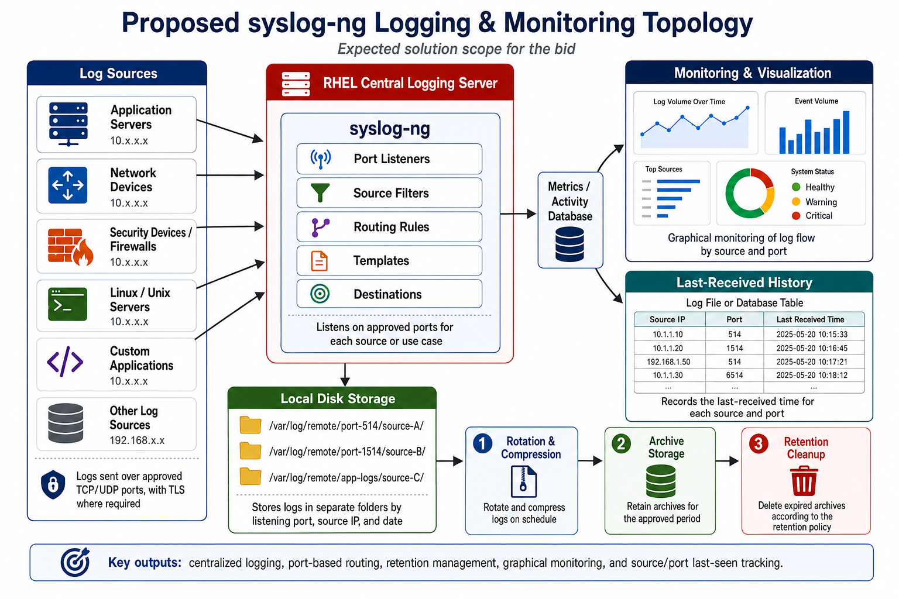
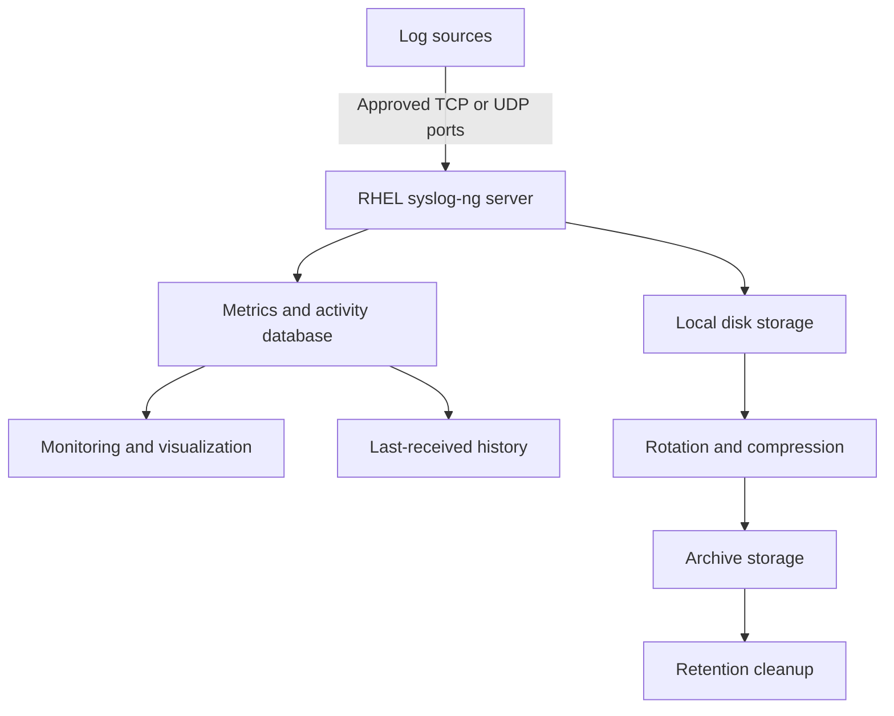

# Proposed syslog-ng Logging and Monitoring Topology

This document explains the proposed centralized logging architecture for the syslog-ng project on Red Hat Enterprise Linux.

The solution collects logs from different servers, network devices, security systems, and applications. It routes the incoming data according to listening port and source, stores it on local disk, applies retention controls, monitors log flow graphically, and records the last time data was received from every source and port.

---

## Topology Diagram



> Place the topology image inside the `documentation/images/` directory. This README should be stored inside the `documentation/` directory so the relative image path works correctly.

---

## Architecture Overview



---

## Main Components

### 1. Log Sources

The centralized server can receive log messages from different infrastructure and application sources.

Examples include:

- Application servers
- Network devices
- Security devices and firewalls
- Linux and Unix servers
- Custom applications
- Other syslog-compatible sources

Every source must be documented in an approved source inventory containing:

| Field | Example |
|---|---|
| Source name | Application-Server-01 |
| Source IP | 10.10.1.20 |
| Listening port | 1514 |
| Protocol | TCP |
| Environment | Production |
| Technical owner | Application Team |
| Expected frequency | Continuous |
| Retention period | 90 days |

Logs are sent over approved TCP or UDP ports. TLS should be used where encryption and authenticated transport are required.

---

### 2. RHEL Central Logging Server

The Red Hat Enterprise Linux server hosts the syslog-ng service and acts as the central collection point.

The server is responsible for:

- Receiving remote log messages
- Validating approved listeners
- Identifying the message source
- Filtering and routing messages
- Applying output templates
- Writing logs to the correct destination
- Updating activity information
- Providing operational metrics

The baseline topology uses one RHEL server. High availability requires a separate design with redundant receivers and storage.

---

### 3. syslog-ng Processing Components

The topology shows five major syslog-ng processing areas.

#### Port Listeners

Listeners receive log traffic on client-approved ports and protocols.

Examples:

- UDP 514 for approved network devices
- TCP 1514 for Linux or application servers
- TCP 6514 with TLS where secure transport is required

The final port list must be provided and approved by the client.

#### Source Filters

Filters can separate or select messages based on information such as:

- Source IP address
- Hostname
- Facility
- Severity
- Application or program name
- Message content
- Receiving listener

#### Routing Rules

Routing rules connect incoming messages to the correct destination. They ensure that messages received from a particular source or port are stored in the intended location.

#### Templates

Templates control output formatting and dynamic directory or filename creation.

They can include values such as:

- Source IP
- Hostname
- Application name
- Year, month, and day
- Listener or use-case identifier

#### Destinations

Destinations define where syslog-ng writes or forwards processed messages.

Possible destinations include:

- Local files
- Databases
- Remote log servers
- Monitoring integrations
- Message queues

---

## Local Disk Storage

Logs are stored in separate folders based on the approved listener, source, and date structure.

Example paths:

```text
/var/log/remote/port-514/source-A/
/var/log/remote/port-1514/source-B/
/var/log/remote/app-logs/source-C/
```

A more detailed structure could be:

```text
/var/log/remote/
├── port-514/
│   └── 10.10.1.20/
│       └── 2026-07-15.log
├── port-1514/
│   └── 10.20.1.10/
│       └── 2026-07-15.log
└── app-logs/
    └── application-01/
        └── 2026-07-15.log
```

The final path must follow the client’s requirements for:

- Filesystem and mount point
- Naming convention
- Ownership and permissions
- SELinux context
- Backup policy
- Storage capacity
- Retention period

---

## Log Lifecycle

The stored logs move through three lifecycle stages.

### Stage 1: Rotation and Compression

Active log files are rotated according to the approved schedule. Rotated files are compressed to reduce storage consumption.

Typical examples include:

- Daily rotation
- Size-based rotation
- Gzip compression
- Controlled service reload or file reopening

Rotation must be tested to confirm that syslog-ng continues writing to the correct active file.

### Stage 2: Archive Storage

Compressed logs are retained for the client-approved period.

The archive policy should define:

- Archive location
- Filename format
- Retention duration
- Backup requirements
- Access permissions
- Recovery requirements

### Stage 3: Retention Cleanup

Expired archives are deleted according to the approved retention policy.

Deletion must not be enabled until:

- The retention period is approved in writing.
- The archive path is verified.
- Filename and age conditions are tested.
- Disposable test data has been used.
- The selected files have been reviewed.
- Backup and compliance requirements are confirmed.

---

## Metrics and Activity Database

The metrics or activity database provides structured information for reporting and monitoring.

It may maintain fields such as:

| Field | Purpose |
|---|---|
| Source IP | Identifies the sending system |
| Listening port | Identifies the receiving listener |
| Protocol | Shows TCP or UDP |
| First received | Records the first observed message |
| Last received | Records the latest observed message |
| Message count | Shows message activity |
| Status | Shows active, warning, or inactive state |

Possible storage choices include:

- PostgreSQL for a shared production database
- SQLite for a small standalone deployment
- Structured log files for a basic implementation
- A client-approved monitoring or time-series platform

The selected solution must not block or interrupt normal log collection when the monitoring database is unavailable.

---

## Monitoring and Visualization

The graphical dashboard provides operational visibility into incoming log flow.

Recommended panels include:

- Log volume over time
- Events received per minute
- Top sources by message count
- Traffic by listening port
- Active sources
- Warning and inactive sources
- Last-received timestamps
- Disk utilization
- Archive growth
- syslog-ng service health
- Queue or dropped-message indicators where available

Example status thresholds:

| Status | Example meaning |
|---|---|
| Healthy | Data received within the approved normal interval |
| Warning | Source is late but has not crossed the critical threshold |
| Critical | No data received beyond the approved inactivity threshold |

Thresholds should be configured per source or source group. A device that normally sends one message every hour must not be evaluated using a five-minute threshold.

---

## Last-Received History

The history component records when data was most recently received from every source and port.

Example report:

| Source IP | Port | Protocol | Last Received Time | Status |
|---|---:|---|---|---|
| 10.10.1.10 | 514 | UDP | YYYY-MM-DD HH:MM:SS | Healthy |
| 10.10.1.20 | 1514 | TCP | YYYY-MM-DD HH:MM:SS | Warning |
| 192.168.1.50 | 6514 | TCP/TLS | YYYY-MM-DD HH:MM:SS | Critical |

This report helps administrators identify sources that have stopped or delayed log forwarding.

---

## End-to-End Data Flow

1. A server, device, firewall, or application generates a log message.
2. The source sends the message to the RHEL server using an approved port and protocol.
3. The network and RHEL firewall permit the approved connection.
4. A syslog-ng listener receives the message.
5. Source filters and routing rules process the message.
6. Templates determine the destination path and output format.
7. The message is written to the correct local directory.
8. Activity data updates the source’s last-received timestamp.
9. Monitoring displays the current flow and source status.
10. Older logs are rotated and compressed.
11. Compressed logs are retained in archive storage.
12. Expired archives are deleted according to the approved policy.

---

## Mapping to Client Deliverables

| Client deliverable | Topology component |
|---|---|
| Install syslog-ng on Red Hat | RHEL Central Logging Server |
| Listen on specific ports | Port Listeners |
| Store data by port and source | Routing Rules, Templates, and Local Disk Storage |
| Compress and archive data | Rotation and Compression plus Archive Storage |
| Delete archived data | Retention Cleanup |
| Display data graphically | Metrics/Activity Database and Monitoring Dashboard |
| Maintain last-received history | Last-Received History |

---

## Security Considerations

- Permit only approved source networks and listening ports.
- Use TLS where sensitive logs require encrypted transport.
- Keep SELinux enforcing and configure appropriate policies or contexts.
- Apply least-privilege ownership and file permissions.
- Protect database and monitoring credentials.
- Synchronize time using the client-approved NTP service.
- Monitor disk capacity to prevent logging failure.
- Protect archives according to data-classification requirements.
- Do not expose the logging server directly to the public internet.
- Do not store credentials or confidential client data in a public repository.

---

## Assumptions

- One supported RHEL server is used for the baseline design.
- The client supplies the server, storage, network access, and repositories.
- The client provides the approved source, port, protocol, and retention inventory.
- Source owners configure their systems to forward logs.
- Monitoring and database platforms require client approval.
- High availability and disaster recovery are outside the baseline topology.
- Custom parsing and SIEM correlation are separate requirements unless included through change control.

---

## Key Outputs

The proposed topology provides:

- Centralized log collection
- Port- and source-based routing
- Structured local storage
- Automated rotation and compression
- Controlled archive retention
- Retention-based deletion
- Graphical log-flow monitoring
- Source inactivity detection
- Source and port last-seen tracking
- Operational documentation and test evidence

---

## Author

**Muhammad Khalid Khan**  
GitHub: [krmaryum](https://github.com/krmaryum)

---

## Disclaimer

This topology is a proposed solution design for bidding, planning, and technical discussion. Final ports, protocols, paths, storage capacity, retention rules, security controls, monitoring tools, database platforms, and availability requirements must be confirmed with the client before production implementation.
