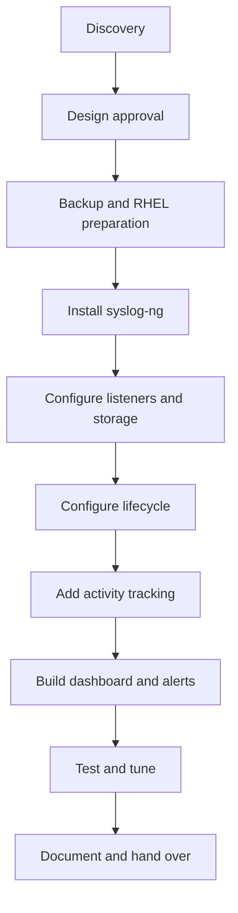

# Syslog-ng Implementation Plan

## 1. Purpose

This document provides a phased implementation method for the centralized logging solution. It must be customized after client discovery and approved before production changes begin.

## 2. Phase Overview



## Phase 1 — Discovery

### Activities

- Confirm RHEL and syslog-ng versions.
- Collect server CPU, memory, disk, and network information.
- Build the source, port, and protocol inventory.
- Confirm expected traffic and retention.
- Identify firewall, SELinux, database, and monitoring standards.
- Confirm maintenance window and rollback expectations.

### Exit criteria

- Requirements and assumptions documented
- Architecture approved
- Access checklist completed
- Retention policy approved

## Phase 2 — Backup and RHEL Preparation

### Activities

- Record the current service and logging state.
- Back up existing configuration.
- Confirm repositories and packages.
- Confirm log filesystem capacity.
- Prepare approved firewall and SELinux changes.

### Exit criteria

- Backup verified
- Rollback procedure documented
- Storage and network prerequisites ready

## Phase 3 — Install syslog-ng

### Activities

1. Install from the client-approved repository.
2. Validate the default configuration.
3. Enable and start the service.
4. Confirm logs contain no startup errors.
5. Confirm service restart behavior.

### Validation examples

```bash
sudo syslog-ng --syntax-only
sudo systemctl enable --now syslog-ng
sudo systemctl status syslog-ng
sudo journalctl -u syslog-ng --no-pager -n 100
```

## Phase 4 — Configure Listeners

### Activities

- Create one source definition per approved port/protocol when separation is required.
- Bind only to approved interfaces.
- Apply source network restrictions.
- Open only the required firewall paths.
- Validate listeners with `ss` and controlled test messages.

### Example inventory

| Listener | Protocol | Purpose | Approved sources |
|---:|---|---|---|
| 514 | UDP | Network devices | Client-defined subnet |
| 1514 | TCP | Linux/application servers | Client-defined subnet |

## Phase 5 — Configure Storage and Routing

### Activities

- Create the approved base path.
- Apply owner, group, permissions, and SELinux context.
- Route messages by listener and source.
- Use a predictable date-based filename.
- Test multiple sources and multiple ports.
- Confirm invalid or missing metadata cannot create unsafe paths.

### Exit criteria

- Each test source writes to the correct folder.
- Files have correct ownership and permissions.
- Service restart does not interrupt the routing design.

## Phase 6 — Configure Lifecycle

### Activities

- Define active-log rotation frequency.
- Compress rotated files.
- Move archives if required.
- Define retention days.
- Test file selection in a disposable directory.
- Receive written approval before enabling deletion.

### Exit criteria

- Forced test rotation succeeds.
- syslog-ng continues writing to the active log.
- Compressed archive is readable.
- Retention selects only intended test files.

## Phase 7 — Activity Tracking

### Activities

- Record source IP, port, protocol, first-received, last-received, and count.
- Define the update frequency.
- Define database or file retention.
- Test repeated messages and new sources.
- Prevent the activity-tracking workflow from blocking log collection.

## Phase 8 — Dashboard and Alerts

### Dashboard panels

- Messages per minute
- Activity per source
- Activity per listener
- Last-received table
- Silent sources
- Disk usage and growth
- Service health

### Alert rules

- Source silent beyond its approved threshold
- Disk utilization above threshold
- syslog-ng service inactive
- Database or metric update failure
- Abnormal queue or dropped-message behavior where supported

## Phase 9 — Testing and Tuning

- Test every approved source/port combination.
- Simulate a stopped source.
- Test rotation and retention safely.
- Validate service restart and optional reboot behavior.
- Review CPU, memory, disk, and queue behavior.
- Correct errors and repeat failed tests.

## Phase 10 — Documentation and Handover

- Update architecture and final port inventory.
- Export sanitized dashboard evidence.
- Deliver configuration backups.
- Deliver operations and troubleshooting runbooks.
- Complete the acceptance checklist.
- Conduct the agreed knowledge-transfer session.

## Rollback Strategy

1. Stop new changes.
2. Capture current error evidence.
3. Restore the last validated configuration.
4. Validate syntax.
5. Restart syslog-ng.
6. Confirm previous logging behavior.
7. Revert firewall or SELinux changes only when part of the approved rollback.
8. Document the incident and next action.

## Implementation Rule

Never combine installation, firewall changes, routing, retention, deletion, database integration, and dashboards into one untested production change. Implement and validate one phase at a time.

