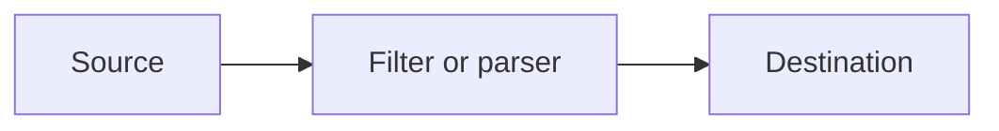
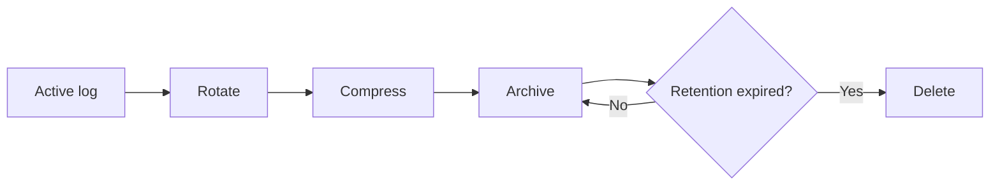

# Syslog-ng Centralized Logging — Study Notes

## 1. What Is Centralized Logging?

Centralized logging sends logs from multiple servers, applications, firewalls, and devices to one managed logging system. Administrators can monitor activity, troubleshoot incidents, apply retention rules, and create reports from a consistent location.

## 2. What Is syslog-ng?

Syslog-ng is a log collection and routing service. It can:

- Receive local and remote log messages.
- Listen on TCP and UDP ports.
- Filter messages by source, host, facility, severity, or content.
- Write messages to files, databases, or remote destinations.
- Create dynamic paths using message metadata.
- Buffer messages and provide operational statistics.

## 3. Core Configuration Objects

| Object | Purpose |
|---|---|
| `source` | Defines where messages enter syslog-ng |
| `destination` | Defines where messages are written or forwarded |
| `filter` | Selects messages using conditions |
| `parser` | Extracts structured fields from messages |
| `rewrite` | Modifies message fields |
| `template` | Controls output format and dynamic paths |
| `log` | Connects sources, filters, parsers, and destinations |

Conceptual flow:



## 4. TCP and UDP

| UDP | TCP |
|---|---|
| Connectionless | Connection-oriented |
| Lower overhead | More reliable delivery behavior |
| Messages may be lost | Connection failures can be detected |
| Common for basic device logging | Better for important server/application logs |

TCP with TLS should be considered when confidentiality and reliable transport are required.

## 5. Important Ports

Common examples include:

- UDP 514: traditional syslog
- TCP 514: syslog over TCP in some environments
- TCP 6514: commonly associated with syslog over TLS
- Custom ports such as 1514 or 2514: used to separate applications or traffic classes

The client must approve the actual ports and protocols. Do not assume that a common port is automatically correct.

## 6. Source-Based Storage

A structured directory design improves troubleshooting and retention management.

```text
/var/log/remote/
├── port-514/
│   ├── 10.10.1.20/
│   │   └── 2026-07-15.log
│   └── 10.10.1.21/
│       └── 2026-07-15.log
└── port-1514/
    └── 10.20.1.10/
        └── 2026-07-15.log
```

Questions to answer before implementation:

- Will folders use source IP, hostname, or both?
- What date format is required?
- What happens if a source changes IP?
- Which user and group own the files?
- Can the dynamic value create an unsafe path?
- Is a separate filesystem used for logs?

## 7. Log Lifecycle



Important terms:

- **Rotation:** closes the current file and starts a new one.
- **Compression:** reduces the storage used by rotated files.
- **Archive:** retains older data in an organized location.
- **Retention:** defines how long data must be kept.
- **Deletion:** removes data after the approved retention period.

## 8. Storage Estimation

Use this planning formula:

```text
Required storage = Daily log volume × Retention days × Compression factor × Safety margin
```

Example:

```text
Daily volume:       20 GB
Retention:          90 days
Compressed size:    40% of original
Safety multiplier:  1.25

20 × 90 × 0.40 × 1.25 = 900 GB
```

Also reserve space for active logs, database growth, temporary files, and operational overhead.

## 9. Last-Received Tracking

The client wants to know:

```text
Source IP | Listener port | Last received time
```

A useful record may contain:

| Field | Meaning |
|---|---|
| Source IP | Sender address |
| Listener port | Port that received the data |
| Protocol | TCP or UDP |
| First received | First observed message |
| Last received | Most recent message |
| Message count | Total or interval count |
| Status | Active, warning, or inactive |

Current-state tracking and historical traffic reporting are different. Historical graphs need interval-based metrics, not only one last-received value.

## 10. Monitoring and Reports

Useful dashboard panels include:

- Messages received per minute
- Volume by source
- Volume by port
- Active and silent sources
- Last-received time
- Disk utilization and archive growth
- syslog-ng service status
- Queue or dropped-message indicators where available

Thresholds must match each source’s normal behavior. A device that sends hourly must not be declared offline after five minutes.

## 11. RHEL Security Areas

- Firewall rules should allow only approved sources and ports.
- SELinux denials should be diagnosed and corrected, not bypassed.
- Log files and database credentials need least-privilege permissions.
- Management dashboards must require authentication.
- Sensitive transport should use TLS when required.
- Logs may contain confidential data and must be handled accordingly.

## 12. Essential Validation Commands

Examples that may be used after adapting them to the environment:

```bash
sudo systemctl status syslog-ng
sudo systemctl is-enabled syslog-ng
sudo syslog-ng --syntax-only
sudo journalctl -u syslog-ng --no-pager -n 100
sudo ss -lntup
sudo firewall-cmd --list-all
getenforce
df -h
du -sh /var/log/remote
```

## 13. Isolation Method for Missing Logs

Check one layer at a time:

1. Did the source generate a message?
2. Is it sending to the correct IP, port, and protocol?
3. Does the packet reach the RHEL server?
4. Is syslog-ng listening?
5. Does the firewall allow the traffic?
6. Does SELinux allow the bind and write operations?
7. Does the message match the intended log path?
8. Can syslog-ng create and write the destination file?
9. Is sufficient disk space available?

## 14. Study Checklist

- [ ] Explain sources, destinations, filters, templates, and log paths.
- [ ] Compare TCP, UDP, and TLS.
- [ ] Create multiple listeners in a lab.
- [ ] Store logs by source and port.
- [ ] Test rotation and compression safely.
- [ ] Calculate storage requirements.
- [ ] Track last-received source activity.
- [ ] Create a basic dashboard.
- [ ] Simulate a silent source.
- [ ] Troubleshoot using the isolation method.

## Disclaimer

Configuration syntax and package availability can vary by RHEL and syslog-ng version. Validate all examples in a lab and follow the client’s approved security and change procedures.

